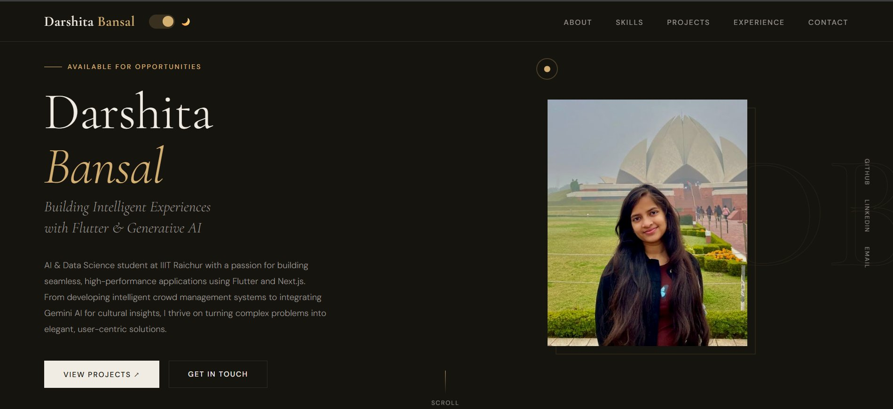

# Darshita Bansal

**AI & Data Science · Flutter · Generative AI**

---

## 👩‍💻 About

AI & Data Science student at **IIIT Raichur** with a passion for building seamless, high-performance applications using Flutter and Next.js. I thrive on turning complex problems into elegant, user-centric solutions — from intelligent crowd management systems to Generative AI cultural experiences.

- 🎓 B.Tech in AI & Data Science · CGPA **8.34 / 10**
- 🛠 Coordinator @ **DevX Club** — leading 50+ developers
- 🌐 Website Team Member @ **IIIT Raichur Official Site**
- 🏓 Silver Medalist — Inter-IIIT Sports Meet 2024-25
- 📍 Raichur, Karnataka, India

---

## 🛠 Skills

**Mobile**
`Flutter` `Dart` `Riverpod` `BLoC` `Provider` `Clean Architecture` `Hive` `go_router`

**Web**
`Next.js` `React.js` `TypeScript` `JavaScript` `Node.js` `Tailwind CSS` `HTML5/CSS3`

**AI / ML**
`Gemini API` `OpenCV` `Scikit-Learn` `Python`

**Tools & Cloud**
`Firebase` `Git` `GitHub Actions` `Vercel` `Figma` `Postman`

---

## 📬 Get in Touch

| | |
|---|---|
| 🌐 Portfolio | [darshitabansal.netlify.app](https://darshitabansal.netlify.app/) |
| 💼 LinkedIn | [linkedin.com/in/darshita-bansal](https://linkedin.com/in/darshita-bansal) |
| 🐙 GitHub | [github.com/darshita2110](https://github.com/darshita2110) |
| 📧 Email | darshitabansal211005@gmail.com |

---

<i>✦ Available for Opportunities ✦</i>

